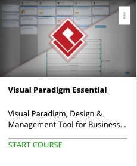

```
Roberto Nogueira  
BSd EE, MSd CE
Solution Integrator Experienced - Certified by Ericsson
```
# Visual Paradigm Essential



**About This Course**
https://www.udemy.com/visual-paradigm-essential/learn/v4/overview
Learn everything you need to about Node.js.

[ Homepage](https://www.udemy.com/visual-paradigm-essential/learn/v4/overview)

## Topics
```
Section: 1
0 / 2
Introduction to Visual Paradigm
[ ] 1. What is Visual Paradigm? 10:17
[ ] 2. Installation and Licensing 9:24

Section: 2
0 / 5
Diagramming
[ ] 3. User Interface Walk-through 19:04
[ ] 4. Drawing Diagram 19:48
[ ] 5. Resource-Centric Interface 11:59
[ ] 6. Using Connectors 4:40
[ ] 7. Making Better Look Diagrams 12:39

Section: 3
0 / 5
Notations & Standards
[ ] 8. Introduction to BPMN 16:40
[ ] 9. Introduction to UML (Part 1) 13:11
[ ] 10. Introduction to UML (Part 2) 18:46
[ ] 11. Introduction to UeXceler 18:17
[ ] 12. Beyond Standard Notations 11:27

Section: 4
0 / 3
Understanding Model & View Concept
[ ] 13. Model Repository 6:20
[ ] 14. Understanding the Concept of View 6:54
[ ] 15. Master View 9:19

Section: 5
0 / 4
Keep and Share Projects
[ ] 16. Central Repository - VPository 9:28
[ ] 17. Working with VPository 15:47
[ ] 18. Keeping Files with VPository 8:22
[ ] 19. Getting Comments from Stakeholders 12:47
 
Section: 6
0 / 3
Generating Documentation
[ ] 20. Generating Specification 19:22
[ ] 21. Compose Your Own Documentation 16:52
[ ] 22. Output Project to Web Contents 12:39
 
Section: 7
0 / 4
Other Features
[ ] 23. Export Diagrams to Image 7:00 
[ ] 24. Import Legacy Design 5:26
[ ] 25. Printing Diagrams 7:21
[ ] 26. Managing Glossary 8:36
```
